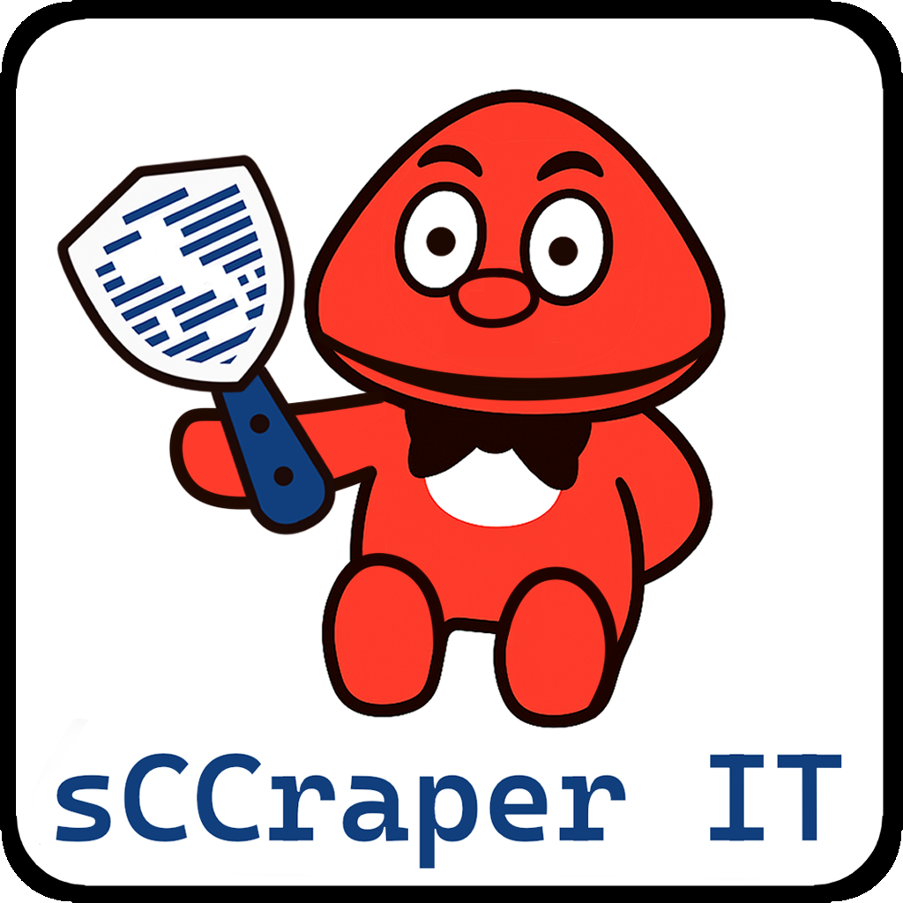

<div align="center"></div>

<h2 align="center">sCCraper IT</h2>

## ✨ Introduction

**sCCraper IT** is a Python-based tool designed to automate the download of all the available **CTF challenges**, including their metadata and attached files, via the platform APIs. It organizes the retrieved content into a structured, easy-to-navigate folder hierarchy.

## 🌐 Supported Platforms

This tool was designed to work with these platforms:

-  [CyberChallenge.IT](https://cyberchallenge.it)
-  [Olicyber.IT](https://training.olicyber.it)

> [!NOTE]  
> Access to the above platforms is required. **sCCraper IT** uses your platform **credentials** to authenticate and retrieve challenge data.

## 🚀 Features

- Login with API token via email/password
- Fetches all challenges in the selected platform
- Downloads all attached files
- Automatically downloads hints (if user is a `SUPERVISOR`)
- Saves everything in a clean folder structure

## ⚙️ Configuration

Update your login credentials and desired base URL in `config.py`:

```python
# Switch Platform
BASE_URL = "https://ctf.cyberchallenge.it"
# BASE_URL = "https://training.olicyber.it"

EMAIL = "your@email.com"
PASSWORD = "your_password"
```

## ✅ Usage

### Clone the repository

```bash
git clone https://github.com/CreepyMemes/sCCraper-IT.git
cd sCCraper-IT
```

### Install dependencies:

```bash
pip install -r requirements.txt
```

### Run the script:

```bash
python -m src.main
```

## 📂 Output structure

After execution, you’ll find the output folder `data/` generated in the **root directory**, with the following structure:

```bash
data/
├── challenges.json/               # Metadata of all challenges
├── challenges/
│   ├── event
│   │   ├── section
│   │   │   ├── challenge
│   │   │   │   ├── challenge.json # Challenge description
│   │   │   │   └── files          # Attached files
```

## 📌 TODO

- [ ] CLI support (e.g. `--email`, `--save-to`)
- [ ] Caching to avoid re-downloading
- [ ] Automatic `.env` support
- [ ] Logging (instead of `print()`)
